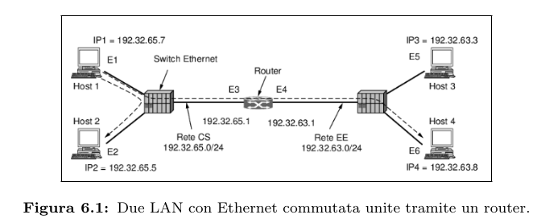
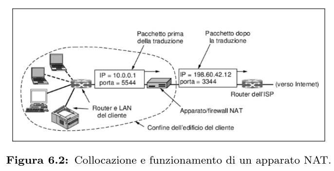

# Internetworking

## Protocolli di Controllo
Il livello Rete ha diversi protocolli di controllo, come ICMP, ARP e DHCP. Qui vediamo le versione per IPv4 in quanto sono le più comunemente usate, ma ne esistono anche versioni per IPv6, come DHCPv6, NDP equvivalente di ARP.

### Internet Control Message Protocol (ICMP)
ICMP è un protocollo usato per inviare messaggi d'errore e altre informazioni operative. Ne esistono due versioni:
* ICMPv4: usato per inviare messaggi d'errore (come quando un pacchetto non può arrivare a destinazione), e per altri strumenti di diagnostica come "ping" per verificare la connettività tra due device.
* ICMPv6: come ICMPv4, ma supporta NDP e altre funzioni di IPv6.

### ARP - Address Resolution Protocol
Anche se le macchine sono identificate da uno o più IP, alla fine per inviare pacchetti è necessario ottenere l'indirizzo MAC delle schede di rete.

La soluzione che si trovò è la seguente:
l'host 1 invia tramite Ethernet un pacchetto broadcast che chiede "chi è il proprietario dell'IP 192.32.65.5?". Il messaggio arriva a tutte le macchine della rete Ethernet e ognuna controlla il proprio IP. Solo l'host 2 risponde inviando il proprio MAC. Così l'host 1 scopre che l'IP 192.32.65.5 corrisponde all'host che ha il MAC E2. Questo sistema si chiama ARP, dall'RFC 826.

In questo modo un gestore di sistema deve solo assegnare un IP per macchina e le subnet mask, poi ARP si occupa di trovare i MAC corrispondenti.

Quando sono necessari cambiamenti nelle associazioni, come un cambio di IP per un dispositivo mantenendo lo stesso MAC, i dati nella cache ARP dovrebbero scadere in pochi minuti.

Per efficientare l'aggiornamento delle cache, ogni computer in rete trasmette la propria associazione in brodacast al momento dell'accensione. Ciò ha l'effetto di inserire una voce nella cache ARP di tutti gli altri computer. Questa operazione si chiama **gratuitous ARP**.

    

In figura l'host 1 vuole inviare un pacchetto all'host 4 (192.32.63.8) sulla rete EE. L'host 1 vedrà che l'IP dell'host 4 non si trova nella rete CS. Sa che deve inviare il traffico fuori rete dal router che prende anche il nome di default gateway e che per convenzione ha l'IP più basso sulla rete. Per farlo però deve conoscere il MAC del gateway, e lo scopre inviano dun broadcast ARP per 198.31.65.1 da cui impara E3 e può poi inviare il frame.

### DHCP - Dynamyc Host Configuration Protocol
Il **DHCP (Dynamic Host Configuration Protocol)** è un protocollo che permette di configurare automaticamente gli host di una rete, evitando la configurazione manuale degli indirizzi IP e di altri parametri.

Quando un computer si avvia, possiede solo l’indirizzo della scheda di rete (MAC/Ethernet) e non un indirizzo IP. Per ottenerlo, invia un messaggio **DHCP DISCOVER** in broadcast. Il server DHCP riceve la richiesta, assegna un indirizzo IP disponibile e lo comunica tramite un messaggio **DHCP OFFER**. Se il server non si trova sulla stessa rete, i router possono inoltrare questi messaggi.

Poiché gli indirizzi IP provengono da un insieme limitato, DHCP utilizza il meccanismo del **leasing**: l’indirizzo viene assegnato per un periodo di tempo determinato e deve essere rinnovato prima della scadenza. In caso contrario, l’host perde il diritto di utilizzare quell’indirizzo, che torna disponibile per altri dispositivi.

Oltre all’indirizzo IP, DHCP può fornire anche altri parametri di configurazione, come **maschera di rete**, **gateway predefinito**, **server DNS** e **server di sincronizzazione dell’orario**. È ampiamente utilizzato nelle reti domestiche, aziendali e dagli ISP, e ha quasi completamente sostituito i protocolli più vecchi **RARP** e **BOOTP**.

## NAT - Network Address Translation

Il **NAT (Network Address Translation)** è una tecnica sviluppata per contrastare la scarsità di indirizzi IPv4, permettendo a più dispositivi di condividere uno o pochi indirizzi IP pubblici.

All'interno di una rete locale, ogni dispositivo utilizza un **indirizzo IP privato**, appartenente a uno dei seguenti intervalli riservati:

* 10.0.0.0 – 10.255.255.255 (/8)
* 172.16.0.0 – 172.31.255.255 (/12)
* 192.168.0.0 – 192.168.255.255 (/16)

Quando un pacchetto esce dalla rete locale, il dispositivo NAT (spesso integrato in router, modem o firewall) sostituisce l'indirizzo IP privato con l'unico indirizzo IP pubblico assegnato alla rete. Per distinguere le comunicazioni provenienti da host diversi, il NAT modifica anche la **porta sorgente** e mantiene una **tabella di traduzione** che associa indirizzi e porte interne a quelle esterne.

Quando arriva una risposta da Internet, il NAT consulta questa tabella per individuare il dispositivo interno corretto e inoltrargli il pacchetto.

    

### Vantaggi

* Riduce il consumo di indirizzi IPv4 pubblici.
* Consente a molte macchine di condividere un solo indirizzo pubblico.
* È semplice da implementare e spesso integrato con funzionalità di firewall.
* È ampiamente utilizzato nelle reti domestiche e nelle piccole aziende.

### Limiti e critiche

* Viola il principio secondo cui ogni host dovrebbe avere un indirizzo IP globale univoco.
* Rompe la comunicazione **end-to-end**, impedendo a host esterni di avviare facilmente connessioni verso host privati.
* Richiede il mantenimento dello stato delle connessioni, rendendo il NAT un punto critico di guasto.
* Viola la separazione tra livelli dei protocolli, poiché deve analizzare anche intestazioni TCP/UDP.
* Può creare problemi con alcuni protocolli e applicazioni (ad esempio FTP).
* Il numero massimo di connessioni gestibili da un singolo indirizzo pubblico è limitato dal numero di porte disponibili (circa 65.536).

Nonostante questi svantaggi, il NAT rimane una soluzione pratica e molto diffusa per affrontare la carenza di indirizzi IPv4, anche nell'era di IPv6.
