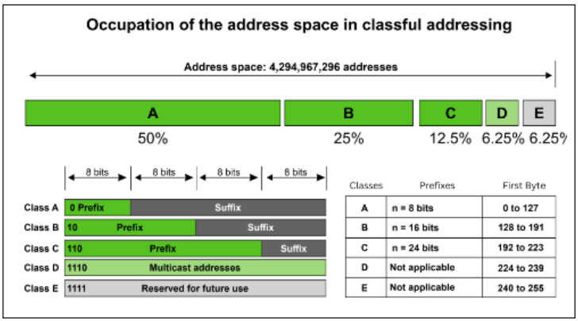
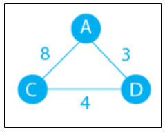

# Livello Rete

## Problemi Architetturali del livello Rete

Il livello rete interconnette i diversi collegamenti punto-punto, per collegare dispositivi geograficamente lontani. I pacchetti vanno dal mittente alla destinazione attraversando tutti i nodi intermedi, e sono interamente ricevuti e ritrasmessi da questi (**store and forward**).

Ci sono due scuole di pensiero sulla progettazione del livello rete:
* coloro che sostengono che debba fornire un servizio orientato alla connessione, rifacendosi all'esperienza delle reti telefoniche, che vorrebbero che sia un servizio affidabile.
* coloro che hanno effettivamente sviluppato Internet, per i quali l'unica preoccupazione dovrebbe essere quella di accettare e inoltrare i pacchetti, ognuno con indirizzo di destinazione e mittente, lasciando controllo di flusso e ordinamento al livello superiore.

## Protocollo IPv4 e Indirizzamento
Per trasferire i pacchetti si è proposto **Internet Protocol**, ossia un protocollo connectionless e inaffidabile in quanto:
* tratta ogni pacchetto in modo indipendente
* non garantisce la consegna
* non garantisce la correttezza dell'informazione trasportata
* non richiede acknowledgement da alcun host, che sia destinatario o nodi intermedi

## Pacchetti IPv4
IP definisce come i dati si spostano e come sono strutturati i dati.

Un pacchetto IP è costituito da un intestazione con le informazioni necessarie all'instradamento, e in IPv4 può essere lunga **fino a 24 byte**, con un **minimo di 20 byte**.

Contiene:
* IP mittente
* IP destinazione
* Dimensione del pacchetto

Poi vi è la componente dati che può variare in dimensione, ed è allineato a 32 bit.

L'intestazione del pacchetto contiene inoltre:
* **Version**: versione di IP usata (4 o 6)
* **Length**: lunghezza dell'intestazione misurata in parole di 32 bit
* **Type of Service**: 5 sottocampi usati per la QoS
    * **tipo di precedenza**
    * **velocità di trasmissione**
    * **affidabilità desiderata**
* **Total Length**: lunghezza complessiva del pacchetto (byte)
* **Identification**: un id univoco del pacchetto
* **Flags**: 3 bit per il controllo del protocollo e della frammentazione
    * **Reserved**: sempre settato a 0
    * **Don't Fragment**: default a 0, se settato a 1 il pacchetto non viene frammentato
    * **More Fragment**: se settato a 0 indica che il pacchetto non è frammentato
* **Fragment Offset**: scostamento di questo frammento del datagramma originale misurato in byte
* **Time to Live**: tempo di vita del pacchetto per evitare che persista nella rete in caso di non riuscita recapitazione. Inizialmente era in secondi, ora in numero di hop
* **Protocol**: protocollo di livello superiore 
* **Header Checksum**: campo usato per il controllo degli errori dell'header
* **Source/Destination IP Address**: IP mittente e destinazione
* **Options**: informazioni facoltative come informazioni sui router o sui percorsi da seguire

## Indirizzamento IP
Un **IPv4** si individua solitamente così:

    208.67.220.220

Formato da 4 numeri decimali separati da punti, ma internamente gli IP sono memorizzati in binario. Nel caso precedente perciò:

    11010000.01000011.11011100.11011100

Il numero di IPv4 esistenti è **2^32** (circa 4 miliardi e 300 milioni).
Originariamente lo schema per individuare un IPv4 era **classful**; l'indirizzo era ad autoidentificazione: per capire la classe a cui apparteneva **bastava identificare i primi 4 bit** più significativi dell'IP.

    

Si formavano **5 classi A,B,C,D,E**, e in ognuna gli IP erano divisi in due campi:
* **netid**: indirizzo che identifica la rete su cui si trova il computer
* **hostid**: indirizzo che identifica il computer all'interno della rete
Una sorta di prefisso + suffisso.

Questa soluzione però era limitante riguardo al numero di host gestibili dalle classi. Se si esaurivano gli IP di una classe bisognava passare alla classe superiore, un cambio non indolore.

Col tempo gli IPv4 si esaurivano, e ciò introdusse l'uso del NAT o mascheramento e della notazione classless. Conosciuta anche come CIDR, consiste nel mantenere l'IP diviso in due parti, ma il numero di bit di rete e host sono dinamici. Si usano maschere di sottorete di lunghezza arbitraria. Un esempio classico è la rete privata che in notazione CIDR si scrive:

    192.168.0.0/24

Il 24 indica che **i primi 24 bit identificano la rete**, mentre gli **8 rimanenti l'host**. La divisione tra rete e host non deve per forza essere fatta a multipli di 8.

Poter dedurre la rete da un IP è cruciale per l'indirizzamento IP: il prefisso infatti è usato dai router per capire verso dove inoltrare un pacchetto per arrivare a destinazione (grazie alla subnet mask e all'ANDing con l'IP esso suppone il gateway, solitamente posto al primo o ultimo IP del range).

Vi è poi una divisione tra **IP pubblici** e **privati**:
* gli **IP pubblici** si usano per interagire con Internet
* gli **IP privati** operano solo nella LAN

Tipicamente il router utilizza IP pubblic per identificare la rete su Internet, mentre al suo interno ai vari dispositivi viene assegnato un IP privato dal router o un altro dispositivo.

L'IP pubblico di una rete viene assegnato al router dagli ISP e può essere dinamico o statico:
* un IP statico non cambia dal momento in cui viene assegnato, ma rimane nel tempo e consente ad alcuni servizi online di funzionare più uniformememte.
* un IP dinamico può cambiare se necessario, come quando un dispositivo cambia rete. In genere le reti domestiche usano IP pubblici dinamici in quanto sono più economici per i Provider e possono risultare più protetti e consentire un maggior anonimato.

Tutti gli IPv4 sono pubblici se non rientrano nella categoria degli IP speciali o nel range degli IP privati. Negli IP privati non importa se lo stesso IP è assegnato anche in altre reti, poiche devono essere univoci solo nella stessa LAN.

I range di IP privati sono:
* IP privato di classe A: 10.0.0.0 - 10.255.255.255
* IP privato di classe B: 172.16.0.0 - 172.31.255.255
* IP privato di classe C: 192.168.0.0 - 192.168.255.255

## Protocollo IPv6 e Indirizzamento
IPv6 è nato negli anni '90 a causa dell'esaurimento degli IPv4. E' un protocollo molto diverso da IPv4 e la sua crescita è stata molto lenta.
Esso usa indirizzi a 128 bit, costituendo uno spazio di indirizzamento molto più grande: 2^128.

La lunghezza degli indirizzi ha portato anche alla loro scrittura in esadecimale, per un totale di 32 caratteri raggruppati in 8 parole da 4 caratteri ciascuno, separate da 2 punti.

Gli indirizzi IPv6 sono molto lunghi, ma sono riducibili, rimuovendo i leading zeros o comprimendo le parti composte da soli zeri (non più di una volta nello stesso indirizzo).
Ad esempio:

    2001:0db8:85a3:0000:0000:8a2e:0370:7334

Può essere scritto:

    2001:0db8:85a3::8a2e:0370:7334

Non è un caso che ci siano tanti zeri, in quanto **la seconda parte di un indirizzo IPv6 identifica sempre l'host**, detta **Interface ID**. Esso è sempre lungo 64 bit. Guardiamo il formato generico dell'intero indirizzo IPv6:
* i primi 64 bit indicano la **Network ID**, e sono ulteriormente divisi in
    * 48 bit di **Prefix** assegnato dall'ISP
    * 16 bit di **Subnet ID**
* i restanti 64 indicano l'**Interface ID**

La IANA ha allocato 1/8 dello spazio di indirizzamento unicast IPv6, ossia quello che inizia per "001" (primo byte=001xxxxx, cioe gli IPv6 = 2xxx::/3), quando finiranno si passerà a 3xxx::/3.

Come in IPv4 si usa la notazione CIDR, e una singola interfaccia si indica con /128.
Vediamo alcuni IPv6 speciali:
* **Unspecified**: ::/128
* **Loopback**: ::1/128

Altri indirizzi speciali sono:
* indirizzi riservati, pari a 1/256 dello spazio e hanno il primo byte = 0; usati da IETF e per IPv4 address embedding
* indirizzi locali (come i privati in IPv4) che sono usati solo in LAN e non sono instradati su Internet.
Iniziano con i seguenti 9 bit: 1111 1110 1 **(da FE8x::/9 e FEFx::/9)**. Si dicono anche "**unregistered**" o "**nonroutable**". Questi si dividono poi in:
* Link-local Addresses: sempre bloccati dai router, e quindi locali a ogni switched LAN o subnet **(FE8x, FE9x, FEAx, FEBx)**.
* Site-Local Addresses: instradati dai router di una organizzazione solo nella rete privata (Site), quindi tra subnet ma non verso internet **(FECx, FEDx, FEEx, FEFx)**.

In IPv6 ogni dispositivo ha un indirizzo pubblico visibile su Internet. Perciò si dicono global unicast (GUA).

In IPv6 l'uso di indirizzi privati è utile per svolgere servizi che devono rimanere interni, come nell reti aziendali.

### Prefix Delegation e Subnetting
Il metodo più usato per configurare le CPE consiste nell'uso di DHCPv6 con Prefix Delegation.

In sostanza, un router dell'ISP delega al router del cliente la possibilità di gestire un prefisso IPv6, di crearci sottoreti e assegnare IP pubblici a tutti i dispositivi in esse presenti. In Europa gli ISP dovrebbero delegare un prefisso statico /56 o /48 a ciascuna linea. Pertanto avrebbero la forma di

    2001:db8.aaaa::/48 
    2001:db8:aaaa:1a00::/56

L'Interface ID di IPv6 occupa sempre la seconda metà dell'IP, quindi il prefisso delegato è divisibile in tante sottoreti (es. /64). Con un prefisso /56 possiamo creare 256 sottoreti /64 (2^64 - 56 = 2^8). Gli IP assegnati ai dispositivi della rete vengono scelti da una o più di queste subnet /64, creando cosi sottoreti dedicate a quella cablata, quella WiFi, quella ospiti, e anche scenari più complessi.
Ogni rete permette di avere circa 18 miliardi di miliardi di IPv6.

Tutti gli IPv6 sono assegnabili manualmente o tramite DHCPv6.
I device che supportano IPv6 hanno anche nativamente un IP link-local, con cui possono scoprire com'è fatta la rete e autoconfigurarsi assegnandosi un IPv6.

Questo sistema si chiama **SLAAC** (Stateless Address Auto Configuration) e non richiede di tracciare in una lista gli IP assegnati.

L'assegnazione può seguire due procedure:
* **assegnazione casuale**: l'IPv6 viene generato casualmente
* **sistema EUI-64**: l'Interface ID viene generato dal MAC della scheda di rete.

### Altre novità di IPv6
* è stato **rimosso** il campo **checksum** dall'header dei pacchetti
* l'**header IPv6 è estensibile**, cioè permette di definire funzioni aggiuntive inserendo header a catena come contenuto del pacchetto
* IPv6 non supporta gli indirizzi broadcast, ma solo unicast, anycast e multicast.
* miglioramenti in ambito sicurezza:
    * **IP Authentication Header**: fornisce ai pacchetti integrità e autenticità, ma non confidenzialità.
    * **IP Encapsulation Security Payload (ESP)**: a differenza del precedente questa modalità dà integrità, autenticazione e confidenzialità.

## Autonomous Systems e Algoritmi di Routing
Le reti sono spesso identificate con gli **Autonomous System** (AS).
Un **AS** è un **gruppo di network gestiti da fornitori di Internet**: sono quindi proprietà degli ISP.
In altre parole un AS è una rete individuale su Internet e ogni rete, o AS, ha un id (**ASN**), assegnato dalla IANA. Gli ASN consentono agli AS di comunicare esternamente e internamente.
I router che instradano internamente a un AS si dicono **interior router**, mentre quelli che instradano tra AS diversi si dicono **edge router**.

In generale, ogni router mantiene in memoria una tabella di routing, che ha come minimi dati di ogni entry:
* Un indirizzo di destinazione: l'IP del nodo destinazione o della rete che lo ospita
* Il tipo di indirizzzo di destinazione: se la destinazione è direttamente collegata al router oppure è l'indirizzo di un altro router (next-hop router).

Gli algoritmi di routing si dividono in:
* Statici: le tabelle sono riempite da un amministratore e i valori non cambiano se non per azione dell'admin
* Dinamici: le tabelle si aggiornano continuamente seguendo l'evoluzione della rete.

Per trovare i percorsi migliori vi sono diverse metriche, come lunghezza del percorso, banda passante, affidabilità del link, ritardo, carico di rete.
Due parametri universalmente accettati sono:
* Hops: numero di nodi attraversati
* Costo: somma dei costi dei link attraversati, misurati secondo una delle metriche sopracitate.

Gli algoritmi di routing sono valutabili in base alla loro:
* Ottimizzazione: abilità dell'algoritmo di scegliere la strada migliore
* Semplicità: grado di funzionalità ed efficienza computazionale
* Rapidità di convergenza: veolcità con cui la le tabelle dei router si re-stabilizzino dopo un cambiamento sulla rete
* Scalabilità: capacità dei router di scegliere i percorsi migliori per i pacchetti che usavano un tratto di network non più disponibile (adattamento)
* Robustezza: capacità di continuare a funzionare a fronte di guasti hardware, alto carico e traffico.

### Distance Vector
Distance Vector è un algoritmo basato sull'algoritmo di Bellmann-Ford. L'idea di base è che ogno nodo mantenga una tabella che ne indica la distanza da ogni altro nodo della rete.
A cold start ogni nodo conosce solo il proprio indirizzo, ignorando la topologia della rete e la distanza dagli altri. Prendiamo una rete come quella in figura.

    

Le tabelle al cold start saranno:

Tabella A
|Nodo|Distanza|Next Hop|
|-|-|-|
|A|0|A|

Tabella C
|Nodo|Distanza|Next Hop|
|-|-|-|
|C|0|C|

Tabella D
|Nodo|Distanza|Next Hop|
|-|-|-|
|D|0|D|

Poi ogni nodo invierà la propria tabella ai suoi vicini più volte, fino a raggiungere la convergenza, e le tabelle diventeranno:

Tabella A
|Nodo|Distanza|Next Hop|
|-|-|-|
|A|0|A|
|C|7|D|
|D|3|D|

Tabella C
|Nodo|Distanza|Next Hop|
|-|-|-|
|A|7|D|
|C|0|C|
|D|4|D|

Tabella D
|Nodo|Distanza|Next Hop|
|-|-|-|
|A|3|A|
|C|4|C|
|D|0|D|

Che succede se cadono uno o più link? Viene fatta una unione delle tabelle tranne di quelle ricevute dal link in errore.
* Il nodo scarta tutti i DV ricevuti da quel link
* Ricalcola la propria tabella fondendo i DV
* Distribuisce il nuovo DV ai vicini

La caduta di un link può causare problemi come:
* **Bouncing**: a causa di un tempo di vulnerabilità tra l'indisponibilità del link e l'invio del DV del nodo non più raggiungibile, l'aggiornamento dei DV farà divergere l'algoritmo fino allo scadere del TTL dei pacchetti.
* **Divergenza**: un loop dovuto alla caduta di più link, per cui se un nodo diventa isolato, non c'è possibilità che l'algoritmo si stabilizzi.
Ciò si chiama Count to Infinity, risolvibile solo tramite una convenzione rappresentativa del valore infinito con una distanza settata a un valore > del diametro della rete.

Per risolvere questi problemi esistono tecniche come:
* **Split Horizon**:
* **Split Horizon con Poison Reverse**:

### Link State

## Congestione

