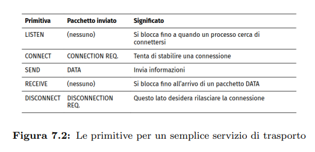
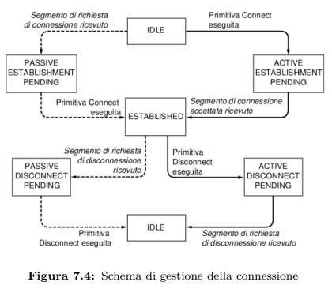
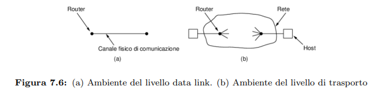

# Capitolo 7 - Livello Trasporto
Il livello trasporto è il cuore dello stack protocollare.

## Descrizione dei Servizi di Trasporto
L'obiettivo del livello trasporto è fornire una trasmissione dati efficace, affidabile e efficiente in termini di costi. perciò il livello trasporto usa i servidi del livello rete. L'hardware e software interno al livello si chiama entità di trasporto, e può essere situata nel kernel dell'OS, in un processo utente separato, in librerie o applicazioni di rete o nella scheda di rete.

Ci sono due tipi di trasporto:
* Orientato alla connessione
* Non orientato alla connessione

Il livello trasporto serve a isolare i livelli superiori, fruitori di questo livello, dalla struttura e imperfezioni della rete (livelli inferiori, fornitori del servizio di trasporto).

### Primitive
Le primitive sono un'interfaccia di utilizzo del servizio di trasporto, fornita agli utenti e ai programmi applicativi.

Consideriamo un'applicazione con un server e due client remoti.
Per iniziare il server esegue una primitiva **LISTEN**, chiamando una procedura di libreria, che esegue una system call che blocca il server fino all'arrivo di un client.

    

I messaggi spediti e ricevuti dalle entità di trasporto si chiamano segmenti. TCP e UDP usano questo termine, mentre altri protocolli usavano il termine TPDU (Transport Control Data Unit).

Ricordiamo, con l'incapsulamento, i segmenti sono contenuti in pacchetti, che a loro volta sono contenuti in frame.

Quando un client vuole comunicare con il server eseguirà una primitiva **CONNECT**, che bloccherà il client chiamante inviando un segmento **CONNECTION REQUEST**. All'arrivo, l'entità do trasporto controlla se il server è bloccato su una **LISTEN**. In tal caso sbloccherà il server e invierà in risposta un segmento **CONNECTION ACCEPTED** al client. Quando questo giunge al client, la connessione è stabilita, e i due possono comunicare tramite **SEND** e **RECEIVE**.

Quando una connessione non serve pià, deve essere rilasciata per liberare spazio nelle tabelle delle connessioni delle entità di trasporto.

La disconnessione ha due varianti:
* Asimmetrica: ogni utente del trasporto può inviare una DISCONNECT all'entità remota, e al suo arrivo la connessione viene rilasciata.
* Simmetrica: ogni direzione viene chiusa separatamente. Quando un lato usa DISCONNECT, non ha altri dati da inviare, ma può ancora accettare dati dal suo partner. La connessione è rilasciata solo quando entrami invocano DISCONNECT.

Qui è presentato un diagramma di stati e transizioni basato sulle primitive.

    

### Socket di Berkeley
Le socket di Berkeley sono un altro gruppo di primitive, usate da TCP.

Il funzionamento è il seguente:
Lato server:
* BIND: crea una socket, assegnandola a un indirizzo locale
* LISTEN: permette al server di accodare connessioni in arrivo
* ACCEPT: per accettare una richiesta di connessione e creare una nuova socket e gestire più connessioni.
Lato client:
* CONNECT: avvia il processo di connessione al server
* SEND: invia dati
* RECEIVE: riceve dati
* CLOSE: rilascia la connessione

## Elementi dei Protocolli di Trasporto
I protocolli di trasporto sono simili ai protocolli data link, in quanto entrambi implementano controllo degli errori, ordinamento e flusso.
Nel datalink però due router comunicano direttamente con un canale fisico cablato o wireless, mentre al livello trasporto il canale fisico è un intera rete, e ciò ha varie implicazioni.

    

Altre differenze sono:
* Indirizzamento esplicito nel livello trasporto: servono indirizzi espliciti delle destinazioni in quanto non vi sono collegamenti punto-punto.
* Complessità nella costituzione della connessione: 
* Possibilità di memorizzazione nella rete: nel datalink, i pacchetti non rimbalzano avanti e indietro, mentre nel trasporto possono avvenire ritardi, perdite, duplicazioni di pacchetti.
* Buffering e controllo di flusso

### Indirizzamento
Il livello trasporto prevede una forma di indirizzamento necessaria a stabilire a quale processo su una macchina recapitare un certo segmento: questi indirizzi si chiamano porte, e sono usate sia in TCP che UDP.

### Stabilire una connessione
L'instaurazione di una connessione, a causa delle imperfezioni come i ritardi, corruzioni o duplicazioni dei pacchetti a cui sono suscettibili le reti, è'un operazione complessa.

Uno scenario problematico è quello di una rete congestionata, dove gli ACK non riescono a tornare indietro in tempo. Ogni pacchetto potrebbe subire un timeout e essere ritrasmesso, generando altra congestione e ritardi. Se la rete è a datagram e i pacchetti seguono percorsi diversi, alcuni di questi possono restare bloccati in zone congestionate, arrivare in ritardo o fuori sequenza rispetto alle aspettative del mittente.

Per affrontare questi problemi si adottano strategie che garantiscano integrità ed efficienza delle connessioni.

#### Orologio di Tomlinson
L’instaurazione di una connessione nelle reti di comunicazione è complessa a causa di problemi come perdita, ritardo, duplicazione e riordinamento dei pacchetti. In reti congestionate, gli ACK possono arrivare in ritardo o non arrivare affatto, causando timeout e ritrasmissioni che peggiorano ulteriormente la congestione. Inoltre, i pacchetti possono seguire percorsi diversi e arrivare fuori sequenza, con il rischio di duplicazioni, ad esempio in transazioni critiche come trasferimenti bancari.

Per ridurre questi problemi si possono usare tecniche come la limitazione della vita dei pacchetti (TTL, hop counter o timestamp). Tomlinson propone una soluzione basata su un orologio locale in ogni host, usato per generare numeri di sequenza che aiutano a distinguere pacchetti vecchi da nuovi, anche se gli orologi non sono sincronizzati. Tuttavia, questo approccio ha problemi nell’instaurazione di nuove connessioni a causa della possibile confusione tra vecchie e nuove richieste.

Per risolvere definitivamente il problema, viene introdotto l’handshake a tre vie (three-way handshake), in cui i due host si scambiano e confermano i numeri di sequenza iniziali prima di iniziare la comunicazione dati, garantendo che la connessione non sia il risultato di duplicati o messaggi in ritardo.

### Rilascio della connessione
La terminazione di una connessione di rete è più semplice dell’instaurazione, ma presenta comunque diverse complicazioni legate a perdite di pacchetti e timeout.

Esistono due modalità: **rilascio asimmetrico** (una sola parte chiude la connessione, come nel telefono) e **rilascio simmetrico**, in cui la connessione è vista come due canali separati e ciascuno deve essere chiuso indipendentemente.

Nel caso tipico del rilascio simmetrico, una parte invia un messaggio di disconnessione (DR), l’altra risponde con un DR e avvia un timer, e infine il primo mittente conferma con un ACK e la connessione viene chiusa da entrambi i lati. I timer servono a gestire la perdita dei pacchetti di controllo.

Se l’ACK finale viene perso, il timer garantisce comunque la chiusura. Se invece si perde il primo o il secondo DR, si attivano timeout e ritrasmissioni del processo di disconnessione.

Il problema diventa più serio nei casi di perdite ripetute: dopo un numero massimo di tentativi (N), il mittente può rinunciare e chiudere comunque la connessione, ma questo può lasciare l’altro lato ancora attivo, creando una situazione di “connessione a metà”.

In generale, il protocollo è pratico ma non perfetto: non esiste una soluzione completamente robusta se si combinano perdite continue e timeout da entrambi i lati, perché si rischia o di non terminare mai la connessione oppure di lasciarla inconsistente.

### Controllo degli Errori e Controllo di Flusso
Il problema del buffering nei protocolli di trasporto con finestre scorrevoli nasce dal fatto che un host può gestire molte connessioni contemporaneamente, richiedendo molta memoria sia per i buffer del mittente (segmenti inviati ma non ancora confermati) sia per quelli del destinatario.

Con segmenti di dimensioni simili si possono usare buffer fissi, ma con dimensioni molto variabili sorgono problemi: se i buffer sono grandi si spreca memoria con segmenti piccoli, se sono piccoli i segmenti grandi richiedono più buffer e aumentano la complessità.

Le soluzioni possibili includono l’uso di buffer a dimensione variabile, che migliorano l’uso della memoria ma sono più complessi da gestire, oppure un singolo buffer circolare per ogni connessione, semplice ma efficiente solo in presenza di traffico elevato.

Un altro approccio separa il buffering dagli acknowledgement, introducendo una finestra scorrevole di dimensione variabile. Il mittente richiede una certa quantità di buffer e il destinatario ne concede una parte; ogni invio riduce la disponibilità del mittente, che si blocca quando raggiunge zero. Gli ACK possono anche includere nuove allocazioni di buffer. Questo meccanismo è quello adottato da TCP tramite il campo “Window size”.

In un esempio, l’host A richiede 8 buffer ma ne riceve 4 da B. A invia tre segmenti, uno dei quali viene perso. Un ACK successivo conferma i dati fino al primo segmento e concede ulteriori buffer per inviare altri segmenti (2, 3 e 4). A prosegue l’invio ma poi si blocca per esaurimento dei buffer. Ritrasmissioni possono avvenire durante il blocco utilizzando buffer già assegnati. Successivamente B conferma i dati fino al quarto segmento ma non concede nuove risorse, mantenendo A in attesa fino a una nuova allocazione.

Quando i buffer non sono più il vincolo principale, il limite diventa la capacità della rete. In questo caso si introduce una finestra scorrevole dinamica che si adatta sia alla capacità del destinatario sia a quella della rete, realizzando controllo di flusso e controllo della congestione.

### Multiplexing

### Ripristino dopo un Crash

### Protocolli a finestra scorrevole

## Il protocollo di trasporto Internet senza connessione: UDP

### Remote Procedure Call: RCP

### Protocolli di Trasporto Real-Time

### RTP

### RTCP

## Il protocollo di trasporto Internet orientato alla connessione: TCP

### Il modello di Servizi

### Intestazione del segmento TCP

### Instaurazione di una connessione

### Rilascio di una connessione

### Modello di Gestione della connessione

### La finestra scorrevole

### Controllo della congestione

### Gestione dei Timer

### WebRTC